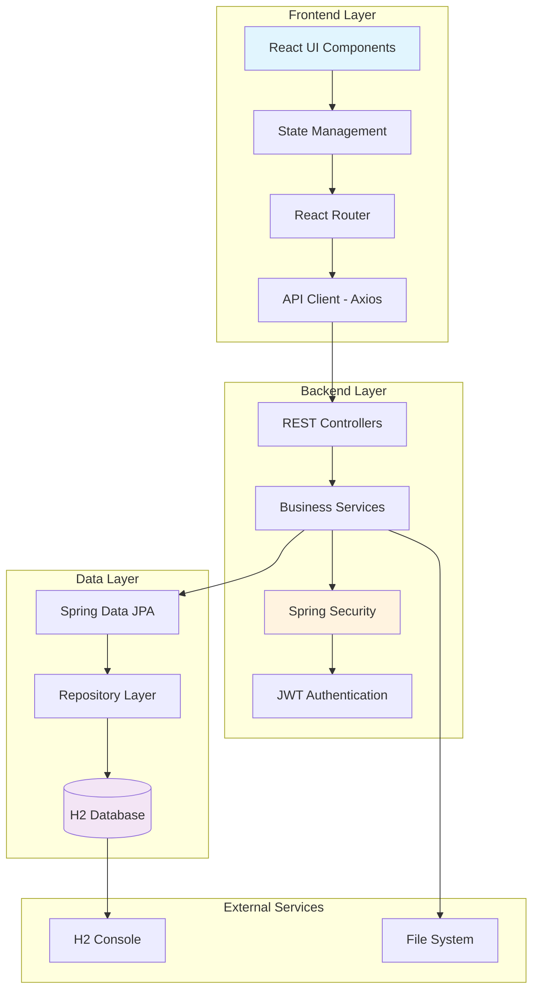
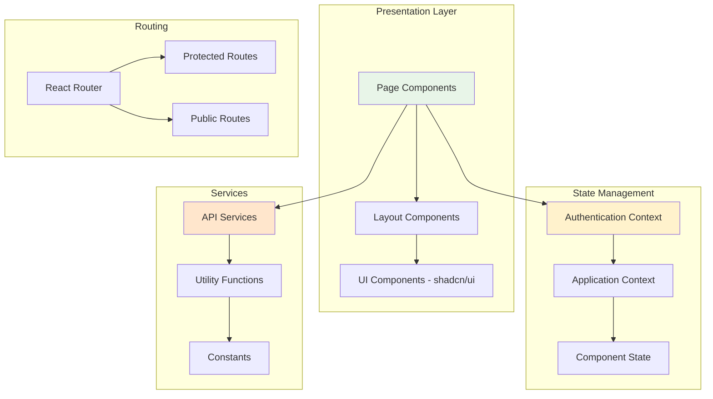
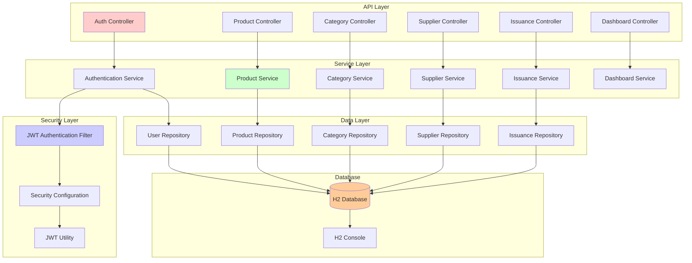
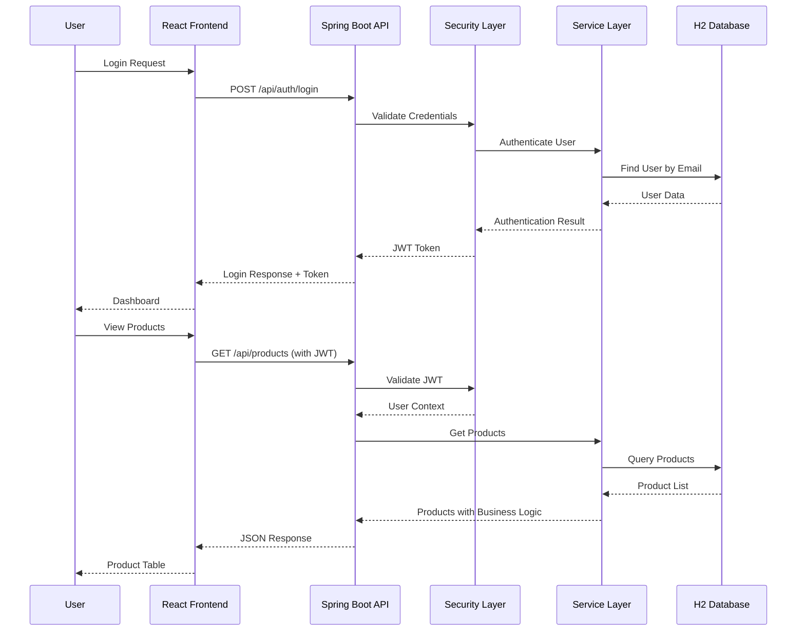
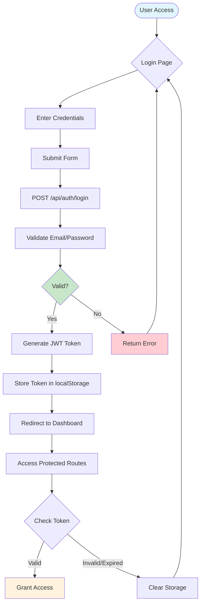
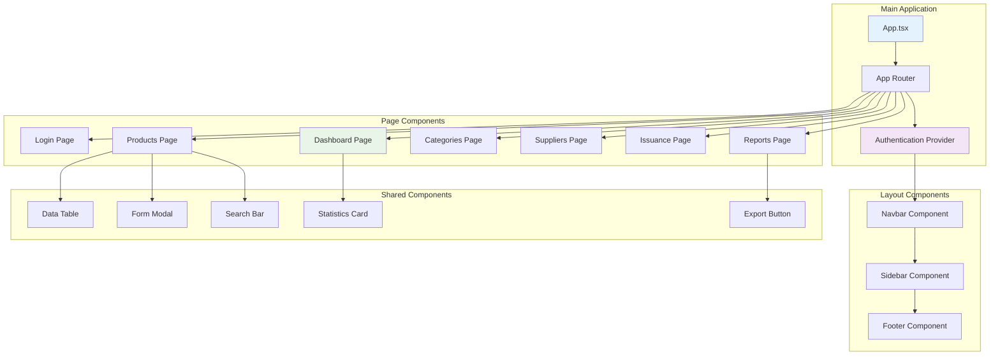
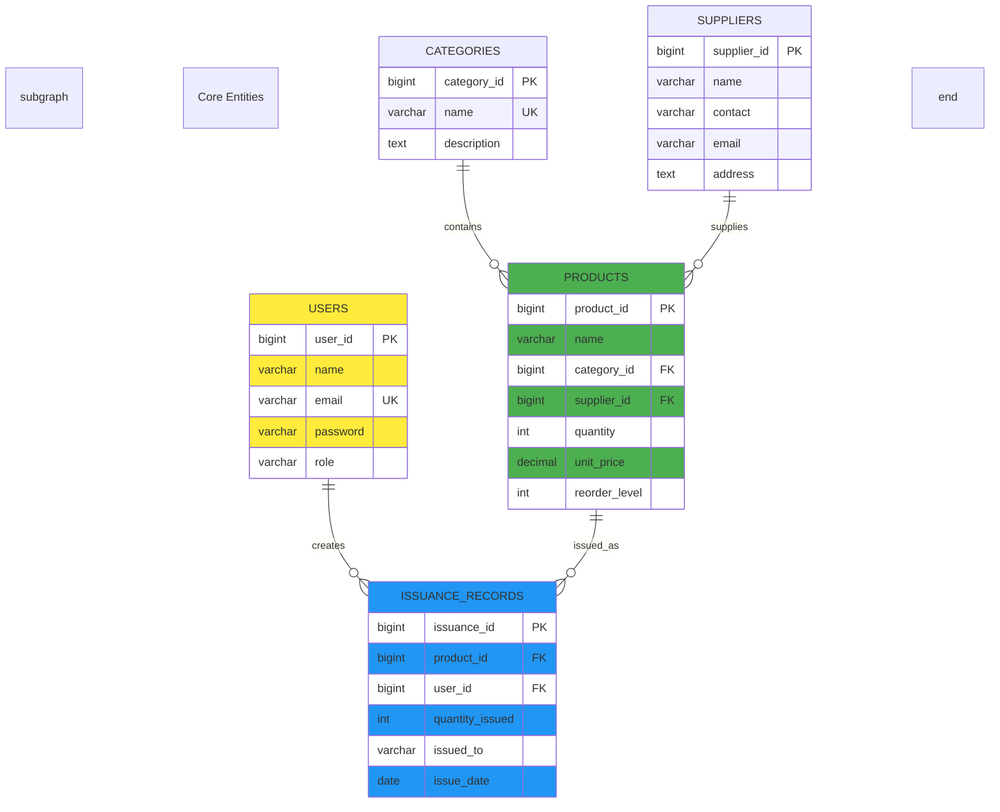
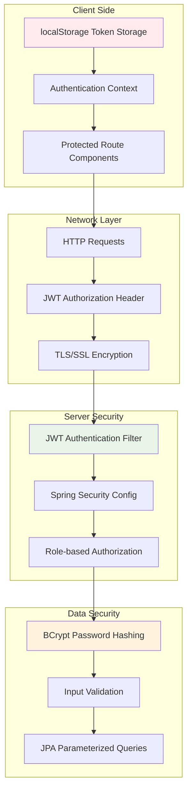
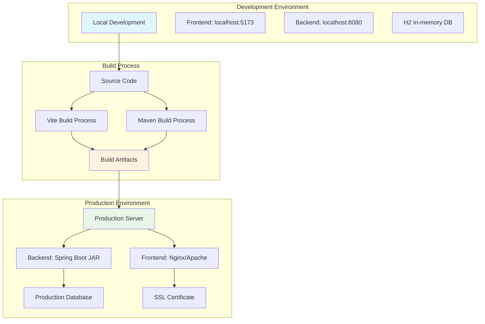

# 🏗️ System Architecture Diagrams

## DIMEC Inventory Management System Architecture

### 1. Overall System Architecture

### 2. Frontend Architecture

### 3. Backend Architecture

### 4. Data Flow Architecture

### 5. Authentication Flow

### 6. Component Architecture

### 7. Database Architecture

### 8. Security Architecture

### 9. Deployment Architecture

### 10. Technology Stack Integration

```mermaid
graph LR
    subgraph "Frontend Technologies"
        React[React 19]
        TypeScript[TypeScript]
        Vite[Vite]
        Tailwind[TailwindCSS]
        Shadcn[shadcn/ui]
        Axios[Axios]
    end
    
    subgraph "Backend Technologies"
        SpringBoot[Spring Boot 3.2]
        Security[Spring Security]
        JPA[Spring Data JPA]
        JWT[JWT Library]
        H2[H2 Database]
        Maven[Maven]
    end
    
    subgraph "Development Tools"
        Git[Git]
        ESLint[ESLint]
        Postman[Postman]
        H2Console[H2 Console]
    end
    
    React --> TypeScript
    TypeScript --> Vite
    Vite --> Tailwind
    Tailwind --> Shadcn
    Shadcn --> Axios
    
    Axios --> SpringBoot
    SpringBoot --> Security
    Security --> JPA
    JPA --> JWT
    JWT --> H2
    H2 --> Maven
    
    Maven --> Git
    Git --> ESLint
    ESLint --> Postman
    Postman --> H2Console
    
    style React fill:#61dafb
    style SpringBoot fill:#6db33f
    style H2 fill:#ff6b6b
```

---

## Architecture Design Decisions

### 1. **Three-Tier Architecture**
- **Presentation Layer**: React frontend with modern UI components
- **Business Logic Layer**: Spring Boot services with security
- **Data Access Layer**: JPA repositories with H2 database

### 2. **Component-Based Design**
- **Modular Components**: Reusable UI components
- **Service Layer**: Business logic separation
- **Repository Pattern**: Data access abstraction

### 3. **Security-First Approach**
- **JWT Authentication**: Stateless token-based auth
- **Role-Based Access**: Granular permission control
- **Input Validation**: Comprehensive data validation

### 4. **Performance Optimization**
- **Lazy Loading**: Efficient data fetching
- **Caching Strategy**: Appropriate caching layers
- **Database Indexing**: Optimized query performance

### 5. **Scalability Considerations**
- **Stateless Design**: Easy horizontal scaling
- **Microservice Ready**: Clear service boundaries
- **API-First**: RESTful design for client flexibility

---

**Architecture Created**: October 27, 2025  
**Design Patterns**: MVC, Repository, Service, JWT Authentication  
**Diagram Tools**: Mermaid (compatible with documentation)
